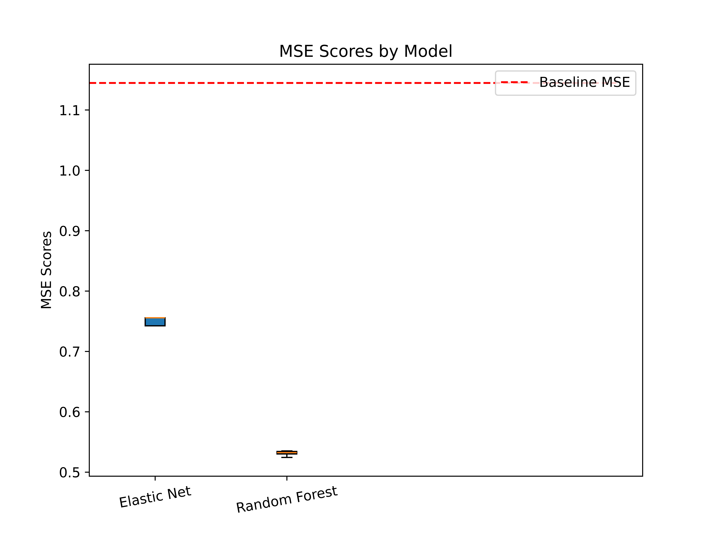
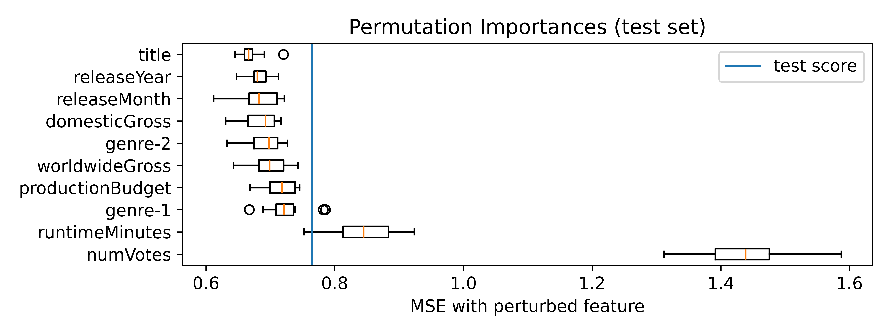
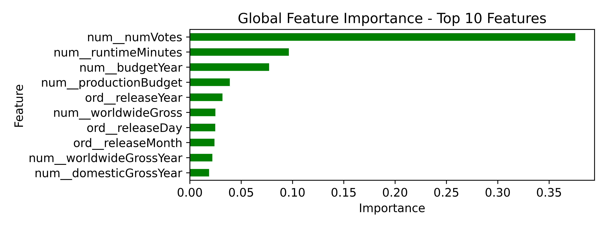

The goal of our machine learning models are to predict the rating of a movie based on our features dataset. If we can create accurate predictions of movie ratings, we can discover what features are most important to a movie's rating - at least according to the model trained our dataset.

Why did you use this ML algorithm?

- We chose to test two ML algorithms, a linear regression (ElasticNet) and a random forest regressor. We chose to do both of these algorithms because we wanted to see which one would provide a more accurate prediciton. If ElasticNet provides a more accurate prediction, we know the relationship between the features of a movie and the target variable (movie rating) is mostly linear. If random forest provides a more accurate prediction, we know the relationship between the features of a movie and its rating is mostly non-linear.

Which other tests did you consider or evaluate?

- We considered doing a classification problem by splitting movies into categories: good, okay, and bad. We decided against this approach, because a regression problem fits the numerical ratings better. Using a categorical target variable would be an oversimplification of the data and goal we are trying to achieve, which is to determine factors that go into a movie's rating.

What metric(s) did you use to measure success or failure, and why did you use it?

- We chose to use mean squared error to measure the success of our models. We chose to use this metric because not only is it a common metric for evaluating regression problems, but also penalizes large errors. We want chose to penalize large errors as to make sure the models we produce aren't overfitting the data.

What challenges did you face evaluating the model?

- A challenge we faced evaluating the model was using the list of genres as a feature. To deal with this, we found that there was _at most_ three genres per movie. So, instead we split the genres list into three columns. If a movie didn't have three genres, the missing genres were filled with `"NA"` values.

Did you have to clean or restructure your data?

- We cleaned our data by:
  1. Removing columns not useful to training our model (non-parsed date)
  2. Converted the genres column into a list object
  3. Drop rows with missing runtime values (only 4 rows)
  4. Feature engineering (combining columns to try and discover relationships)
- We kept our data in the same CSV structure.
- This cleaning process allows us to more efficiently and accurately train our models.
- Our full cleaning process can be found at (src/preprocessing.ipynb)[src/preprocessing.ipynb]

What is your interpretation of the results? Are you satisfied with your prediction accuracy?

- From our results, we found that the random forest regressor performed better than the ElasticNet linear regressor. Random forest had a mean squared error of 0.596 +- 0.037 on the test data, while ElasticNet had a mean squared error of 0.808 +- 0.052 on the test data. Because random forest regressor performed better than ElasticNet, we can assume the relationship between our movie dataset features and movie ratings is more complex than just a linear relationship, being mostly non-linear. Our random forest regressor also performed better than the baseline model, which had a mean squared error of 1.145. Because our MSE for random forest was around half of the baseline model, we are satisfied and can say that our model is significantly better than the baseline model at predicting movie ratings.

- Below is a figure comparing MSE values for both models against the baseline MSE:

| MSEs across models compared to baseline |
:---:
|  |

For prediction projects, we expect you to argue why you got the accuracy/success metric you have. Intuitively, how do you react to the results? Are you confident in the results?

- We got the MSE metric we have by performing a machine learning pipeline. The high-level of the steps include:
  1. Preprocessing and cleaning data
  2. Defining a preprocessor pipeline for the model
  3. Defining a parameter grid for cross validation of the model
  4. Splitting the data into a training/validation set and testing set
  5. Performing a grid search, using 5 Kfolds cross validation, using the training/validation set
  6. Creating and testing the best model on the testing set using params from grid search
  7. Repeating steps [4-6] for different random states to reduce random error
  8. Save results
- Through this pipeline, we can be sure the results we received were not just due to random chance, and can hold a confidence that our model can predict movie ratings within a certain MSE.
- Intuitively, we are confident in our results. We are confident because not only is the MSE low with low variation, but the after evaluating the model, we can determine some factors that go into a movie's rating. From our evaluation, we found the features with greatest global feature importance to be defined as below:

|                 Permutation Importance                 |                   RandomForest Importance                    |
| :----------------------------------------------------: | :----------------------------------------------------------: |
|  |  |

- From these figures, we see that movie runtime and number of votes play the biggest role in determining a movie's rating. This is followed by the a variation of the movie's budget. It would make sense that these three factors play the biggest role in determining a movie's rating, because all three are directly related to the movie's production itself. Movies with more ratings means they are likely more popular and thus are rated higher. Movies with higher budgets likely have a higher production quality, and therefore a higher rating.

Did you find the results corresponded with your initial belief in the data? If yes/no, why do you think this was the case?

- The results correspond with our initial belief, that movie budgets would impact a movie's rating. We believed this because movies with greater budgets will have the resources to produce higher quality cinematography and the opportunity for special effects among other features. These features likely correlate to higher ratings, as they make a movie stand out. We also believed that the number of ratings a movie gets would correspond to its rating. As well, movies with higher budgets likely get more ratings as they are from bigger studios and have better marketing. With all this said, it did make sense that those features would correspond to a movie's rating. It isn't exactly clear why a movie's runtime would correspond with its rating, but I would assume that our dataset includes shorter films that are of lower quality than some main stream average length movies (~2 hours).

Do you believe the tools for analysis that you chose were appropriate? If yes/no, why or what method could have been used?

- I believe the tools we chose for analysis were appropriate. Because the ratings we had were numerical, it was logical to train regression models, and these models would then allow us to evaluate which features held the greatest weight when determining a movie's rating. We chose to try both linear and non-linear models, as it isn't clear beforehand which models would perform better. We could have tried bucketting the rating into categories and turned this into a classification problem, but this would be an oversimplification of what we were trying to achieve. We also could have tried XGBoost, as it's a popular model for regression problems.

Was the data adequate for your analysis? If not, what aspects of the data were problematic and how could you have remedied that?

- The data was adequate for our analysis. We had enough data to generate accurate models for predicting movie ratings. The only issue we had was with splitting genres column, which we fixed by creating multiple columns for genres. The amount of data we had also seemed to be enough for ElasticNet, as we trained our models on different training set sizes and found there wasn't a significant difference in MSE. It's possible more data could have been useful for random forest regressor, as the MSE of the testing set was continuing to decrease through the our largest training set size. We could have expanded our dataset to more sources than just the IMDb dataset and The Numbers dataset if we would want to increase the size of training sets, which could possible decrease the MSE of the random forest regressor.

|            ElasticNet Training size vs MSE            |           Random Forest Training size vs MSE            |
| :---------------------------------------------------: | :-----------------------------------------------------: |
|  |  |
